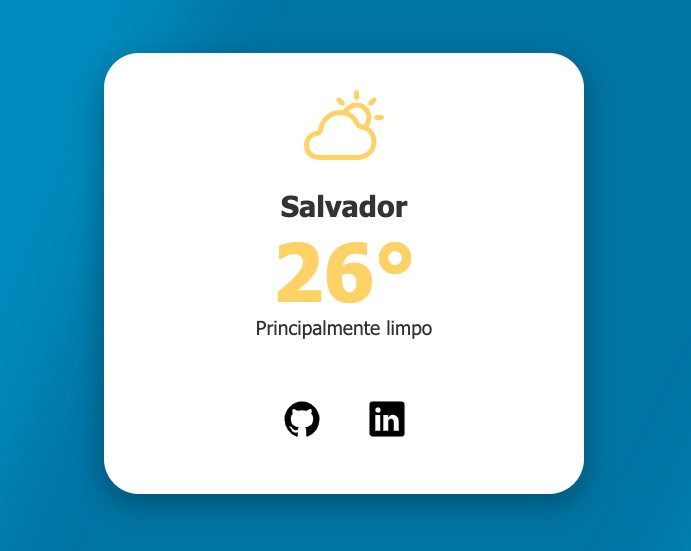

  
  
  

# ☀️ Previsão do tempo dinâmica

## ✨ Visão Geral do Projeto

Este projeto é um cartão de previsão do tempo moderno e responsivo, desenvolvido com HTML, CSS puro e JavaScript. Ele exibe a temperatura atual e a condição do tempo para **Salvador, Brasil** ou qualquer outra cidade que o usuário configurar em **script.js**, obtendo os dados em tempo real através da API do Open-Meteo.

O design prioriza a legibilidade e a estética, utilizando cores dinâmicas que se adaptam à condição climática (ensolarado, nublado, chuvoso, etc.) além de um wallpaper dinâmico de acordo com a resolução do seu aparelho.

---

## 🚀 Tecnologias Utilizadas

| Tecnologia            | Finalidade                                                               |
| :-------------------- | :----------------------------------------------------------------------- |
| **HTML5**             | Estruturação básica do cartão de informações.                            |
| **CSS3**              | Estilização moderna, responsividade e animações.                         |
| **JavaScript (ES6+)** | Lógica para requisição e manipulação de dados da API.                    |
| **Open-Meteo API**    | Fonte gratuita e aberta para dados de previsão do tempo.                 |
| **Ion Icons**         | Biblioteca de ícones dinâmicos para representar as condições climáticas. |

---

## 📋 Funcionalidades

- **Exibição em Tempo Real:** Busca a temperatura e o código de tempo atual da localização fixa.
- **Design Responsivo:** Layout adaptável a diferentes tamanhos de tela.
- **Estilo Moderno:** Uso de `box-shadow` e `border-radius` para criar um efeito de cartão flutuante.
- **Ícones e Cores Dinâmicas:** O ícone e a cor primária mudam automaticamente conforme a condição climática (`sunny-outline` para sol, `rainy-outline` para chuva, etc.).
- **Interatividade:** Efeito de _hover_ suave nos ícones sociais usando `transform: scale()`.

---

## 💻 Demonstração

  

### Pré-requisitos

Você só precisa de um navegador moderno.

## Créditos

O projeto apresentado tem fins estudantis e pode ser utilizado em projetos não-comerciais.

---

Feito com ❤️ por **Enivaldo Oliveira**
